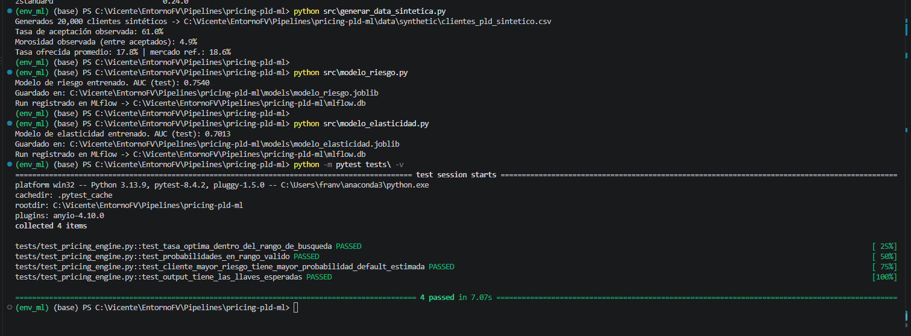
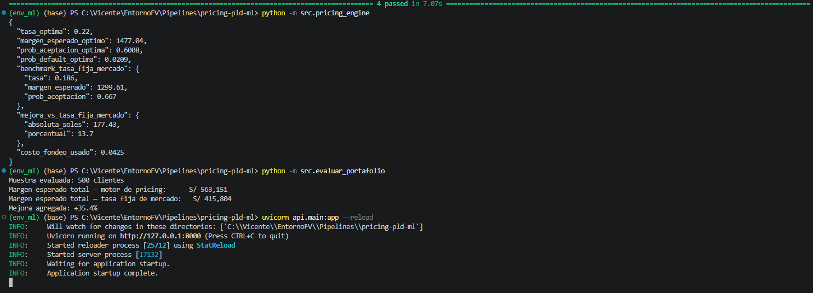
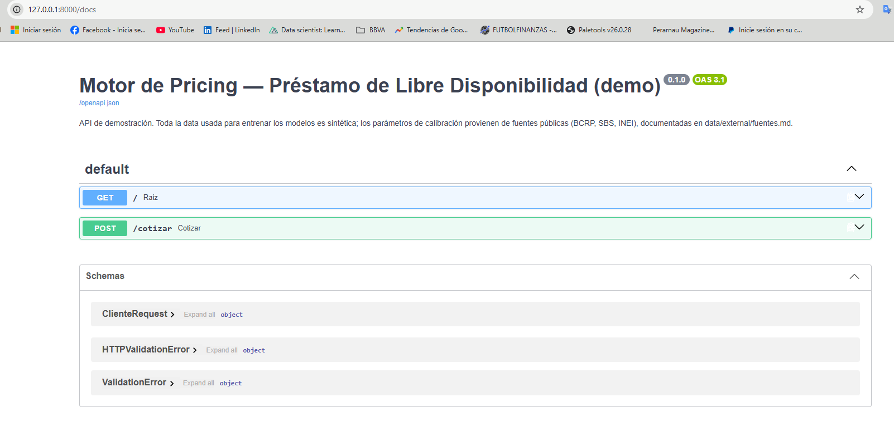
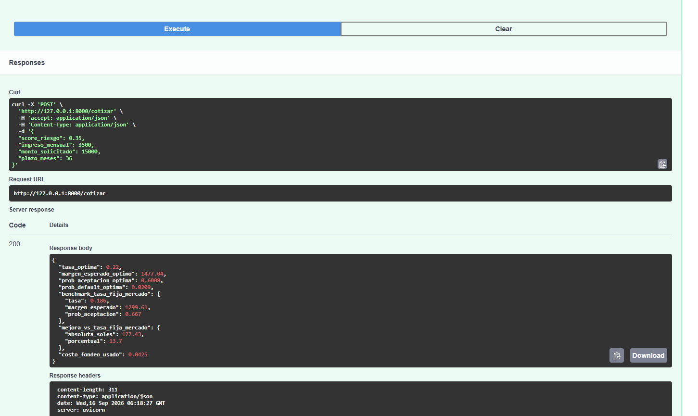

# Sistema de Pricing Predictivo para PLD
### Modelado de riesgo, elasticidad de tasa y optimización de margen — Préstamo de Libre Disponibilidad (Perú)

## El problema

En banca retail, definir la tasa de un crédito no es solo "cuánto puedo
cobrar" — es un trade-off entre dos fuerzas que compiten:

- **Spread:** a mayor tasa, mayor margen por cada crédito colocado.
- **Volumen:** a mayor tasa, menor probabilidad de que el cliente acepte
  (y los pocos que sí aceptan a tasas muy altas tienden a ser de peor
  riesgo — selección adversa).

Este proyecto construye un sistema que, dado el perfil de un cliente,
**encuentra la tasa que maximiza el margen esperado del portafolio**,
considerando ambos efectos simultáneamente — no optimiza margen ignorando
volumen, ni maximiza volumen regalando spread.

## Resultado principal

Evaluado sobre una muestra de 500 clientes sintéticos, comparando la tasa
óptima del sistema contra una política de tasa fija igual al promedio de
mercado (peers SBS):

| Política | Margen esperado total |
|---|---|
| Tasa fija de mercado (18.6%) | S/ 415,804 |
| **Motor de pricing (tasa personalizada)** | **S/ 563,151** |
| **Mejora** | **+35.4%** |

(Reproducible con `python -m src.evaluar_portafolio`)

## Arquitectura

```
Cliente (score riesgo, ingreso, monto, plazo)
        │
        ▼
[modelo_riesgo.py] ─────► P(default)  — LightGBM, AUC 0.75
        │
        ▼
[optimizador_pricing.py] barre tasas candidatas (14%-32%)
        │
        ├─► para cada tasa candidata:
        │     [modelo_elasticidad.py] → P(aceptación | tasa, perfil) — LightGBM
        │                                con restricción de monotonicidad
        │                                (P(aceptación) no-creciente en tasa)
        │     margen_esperado = P(aceptación) × monto × (tasa − costo_fondeo − P(default)×LGD)
        │
        ▼
[pricing_engine.py] → tasa óptima + margen esperado + comparación vs. mercado
        │
        ▼
[api/main.py] → expone todo esto como endpoint REST (FastAPI)
```

## Datos

**100% de la data de clientes es sintética.** Ningún registro individual
proviene de datos reales de BBVA ni de ninguna otra entidad — esto es
deliberado, no una limitación oculta: usar datos reales de clientes fuera
del marco autorizado de la empresa no es aceptable bajo ninguna
circunstancia.

Lo que sí es real: los **parámetros agregados** con los que se calibró la
generación sintética (costo de fondeo, tasas de mercado de los 4 bancos
más grandes, ingreso promedio de Lima Metropolitana), tomados de fuentes
públicas oficiales (BCRP, SBS, INEI). El detalle exacto de cada fuente,
con fecha de consulta y link, está en
[`data/external/fuentes.md`](data/external/fuentes.md).

## Un matiz técnico que vale la pena mencionar

Durante la construcción, el optimizador inicialmente elegía tasas
absurdamente altas (borde superior del rango de búsqueda) porque el
modelo de elasticidad, al no tener suficientes datos de entrenamiento en
zonas de tasa muy alta, se "aplanaba" en lugar de seguir bajando la
probabilidad de aceptación. Se corrigió con dos decisiones:

1. **Restricción de monotonicidad** en el modelo de elasticidad
   (`monotone_constraints` de LightGBM), forzando que P(aceptación) sea
   no-creciente en la tasa ofrecida — una restricción estándar en modelos
   de pricing para evitar comportamientos económicamente inconsistentes.
2. **Acotar el rango de búsqueda** del optimizador al rango de tasas
   efectivamente representado en el histórico de entrenamiento, en vez de
   dejar que el optimizador extrapole el modelo fuera de esa zona.

## Tracking de experimentos (MLflow)

Ambos scripts de entrenamiento (`modelo_riesgo.py`, `modelo_elasticidad.py`)
registran automáticamente en MLflow (backend SQLite, `mlflow.db`):
hiperparámetros, features usadas, tamaño de train/test, y el AUC de test.
Para verlo:

```bash
mlflow ui --backend-store-uri sqlite:///mlflow.db
```

Y abrir http://127.0.0.1:5000 en el navegador.

## Evidencia de ejecución (capturas reales, no mockups)

El sistema fue corrido de punta a punta en un entorno Windows independiente
(Python 3.13.9), el 16/09/2026, reproduciendo exactamente los mismos
resultados que en el entorno de desarrollo original — mismo AUC, misma
tasa óptima, misma mejora de portafolio. Esto confirma que el proyecto es
reproducible, no un resultado que solo corre en una máquina.

**1. Generación de data, entrenamiento de ambos modelos, y tests en verde:**



**2. Pricing engine, evaluación de portafolio (+35.4%), y arranque de la API:**



**3. Documentación interactiva de la API (Swagger, autogenerada por FastAPI):**



**4. Respuesta real del endpoint `/cotizar` (200 OK):**



## Cómo correrlo

```bash
python3 -m venv .venv
source .venv/bin/activate          # Windows: .venv\Scripts\activate
pip install -r requirements.txt

python src/generar_data_sintetica.py   # genera data/synthetic/clientes_pld_sintetico.csv
python src/modelo_riesgo.py            # entrena y guarda models/modelo_riesgo.joblib
python src/modelo_elasticidad.py       # entrena y guarda models/modelo_elasticidad.joblib
python -m src.pricing_engine           # cotiza un cliente de ejemplo
python -m src.evaluar_portafolio       # métrica de portafolio (el resultado de arriba)

pytest tests/                          # 4 tests de sanidad

uvicorn api.main:app --reload          # levanta la API en http://127.0.0.1:8000/docs
```

## Limitaciones conocidas (declaradas, no escondidas)

- Se usa **TEA**, no TCEA, para el benchmark de mercado (la SBS publica
  TCEA en una herramienta distinta a la usada aquí). Ver `fuentes.md`.
- El modelo de riesgo trata el score de riesgo como un **insumo dado**
  (simulado), no construye un modelo de PD real — ese es trabajo del área
  de Riesgos, no de Pricing.
- El coeficiente de variación del ingreso (usado para la distribución
  sintética) es un supuesto propio, no un dato de INEI.
- El rango de búsqueda de tasas del optimizador está limitado al rango
  observado en el histórico simulado; ampliarlo en un escenario real
  requeriría más experimentación comercial (más variación de tasas
  ofrecidas), no solo cambiar un parámetro.

## Stack

Python · pandas/numpy · LightGBM · scikit-learn · FastAPI · pytest
